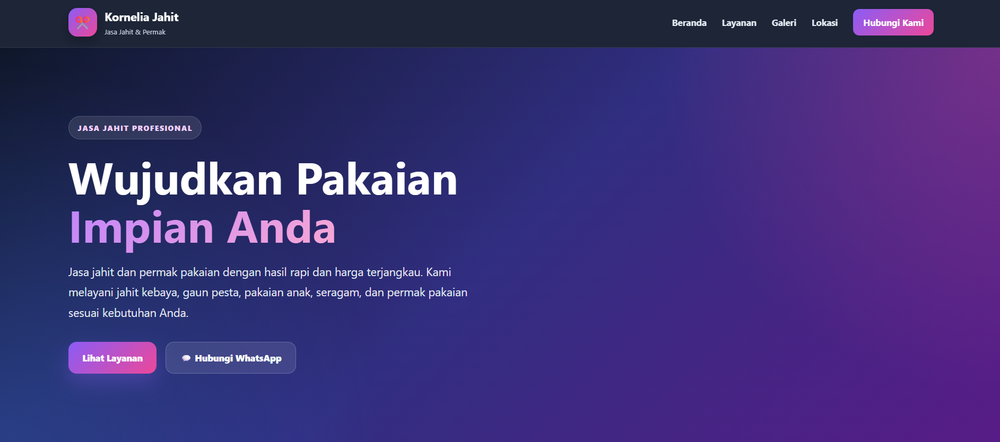
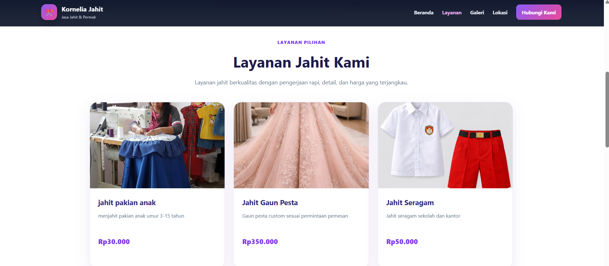
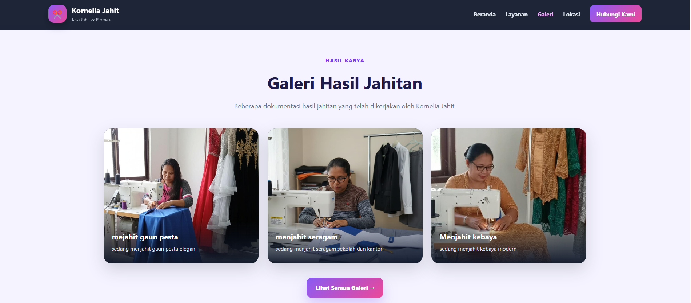
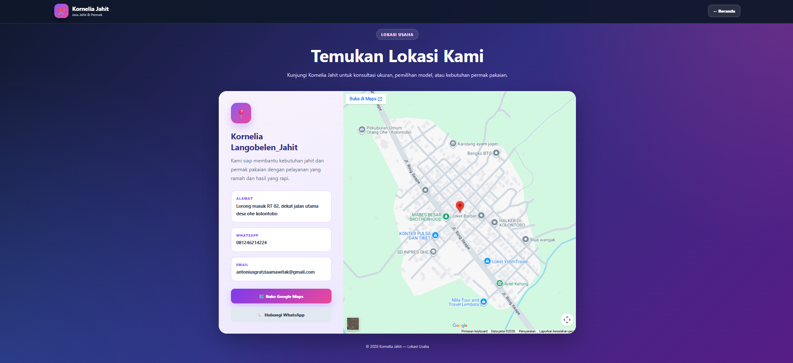
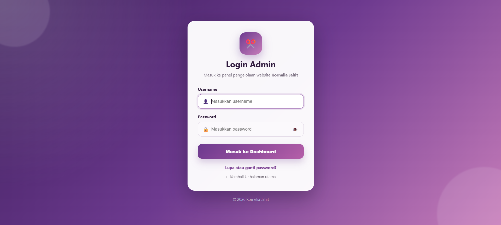
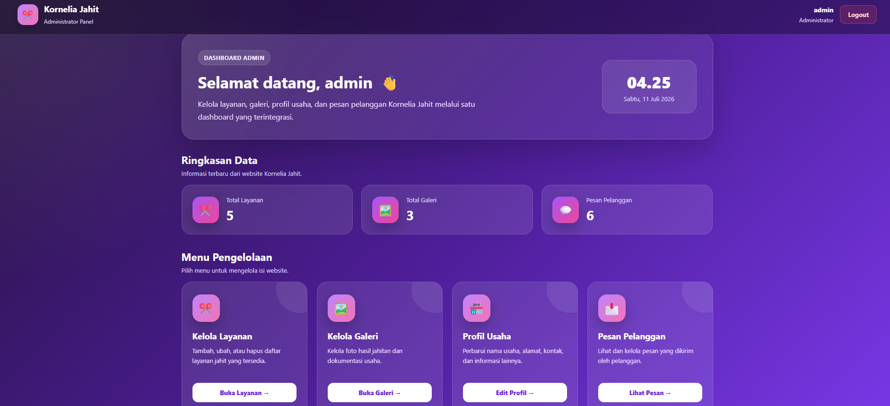
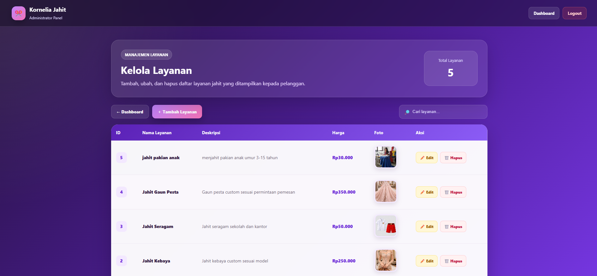
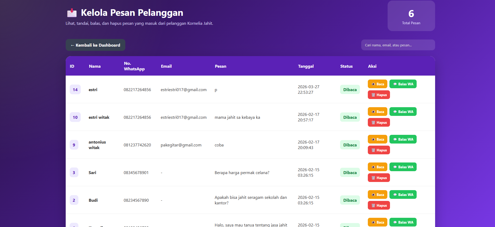

# 🧵 Kornelia Penjahit

Website jasa jahit berbasis *PHP Native* yang dirancang untuk membantu pengelolaan usaha jahit secara digital. Proyek ini menyediakan website informasi bagi pelanggan serta dashboard admin untuk mengelola layanan, galeri, dan pesan pelanggan.

---

## 🚀 Teknologi yang Digunakan

- PHP Native
- MySQL
- HTML5
- CSS3
- JavaScript
- PHPMailer
- XAMPP

---

## ✨ Fitur Utama

- 🏠 Landing Page
- 👗 Informasi Layanan Jahit
- 🖼️ Galeri Hasil Jahitan
- 📍 Lokasi Usaha
- 📩 Form Kontak
- 🔐 Login Admin
- 📊 Dashboard Admin
- 🛠️ Manajemen Layanan (CRUD)
- 🖼️ Manajemen Galeri (CRUD)
- 💬 Manajemen Pesan Pelanggan

---

# 📸 Project Preview

#### Beranda

#### Daftar Layanan

#### Galeri Hasil Jahitan

#### Lokasi Usaha

### Panel Admin

#### Login Admin

#### Dashboard Admin

#### Kelola Layanan

#### Pesan Pelanggan
